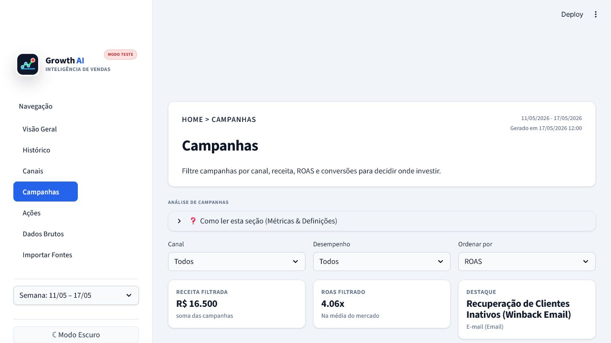

# Growth AI Intelligence


**Agente de IA em Python para relatórios semanais de Growth Marketing.**

O projeto coleta dados de growth, normaliza fontes diferentes, gera uma leitura executiva com Gemini ou OpenAI e entrega tudo em um dashboard Streamlit com modo claro/escuro, histórico, diagnóstico por canal, ranking de campanhas, ações recomendadas e central de importação.

## Destaques

- Dashboard executivo em Streamlit com novo logo, tema claro/escuro e navegação lateral.
- Modo teste sem IA ativado automaticamente quando não há chave configurada.
- Ativação automática de IA quando `GEMINI_API_KEY` ou `OPENAI_API_KEY` existe no `.env`.
- Normalização de CSV, Excel, Google Sheets, PDF, HTML e texto para um schema comum.
- Geração de relatório estruturado em JSON com recomendações acionáveis.
- Comparativos de receita, conversões, ROAS, canais, campanhas, riscos e próximos passos.
- Testes automatizados para configuração, normalização, métricas e formatadores da UI.

## Telas

### Visão Geral

Resumo executivo da semana com receita, conversões, ROAS médio, riscos, gráfico histórico e distribuição por canal.


### Diagnóstico por Canal

Mostra participação na receita, variação por canal, diagnóstico e decisão recomendada.


### Ranking de Campanhas

Lista campanhas filtráveis por canal e desempenho, com ROAS limpo, benchmark de mercado e contexto de investimento.



### Importar Fontes

Central para importar arquivos, conectar Google Sheets e rodar o pipeline em modo teste ou com IA.


## Como Funciona

```text
Fontes externas
  |-- PDF
  |-- CSV
  |-- Excel
  |-- Google Sheets
  |-- HTML/Textos
        |
        v
Coletores
        |
        v
Normalização de dados
        |
        v
Schema interno comum
        |
        v
Gemini/OpenAI ou modo teste
        |
        v
Relatório JSON
        |
        v
Storage local
        |
        v
Dashboard Streamlit
```

## Normalização

A camada `src/growth_report/normalization.py` transforma colunas diferentes em campos comparáveis antes da IA analisar os dados.

Exemplo de registro normalizado:

```json
{
  "source_name": "Google Ads Export",
  "source_kind": "google_ads",
  "channel": "Pesquisa Paga (Paid Search)",
  "campaign": "Brand Protection",
  "spend": 1200,
  "clicks": 540,
  "conversions": 88,
  "revenue": 6200,
  "currency": "BRL"
}
```

| Origem | Colunas aceitas | Campo interno |
| --- | --- | --- |
| Google Ads | `Cost`, `Spend`, `Custo` | `spend` |
| CRM | `Leads`, `Vendas`, `Conversions` | `conversions` |
| Financeiro | `Revenue`, `Receita`, `Faturamento` | `revenue` |
| Campanhas | `Campaign`, `Nome da campanha`, `Campanha` | `campaign` |
| Canais | `Channel`, `Canal`, `Origem`, `Plataforma` | `channel` |

## Estrutura

```text
src/growth_report/
  collectors/          # Coleta PDF, CSV, Excel, Sheets, HTML e texto
  normalization.py     # Mapeia fontes diferentes para um schema comum
  services/            # Geração com IA e persistência
  ui/                  # Componentes, páginas e tema do dashboard
  pipeline.py          # Orquestra coleta -> normalização -> IA -> storage
  cli.py               # Comandos growth-report run/schedule

data/
  raw/                 # Arquivos importados ou exemplos locais
  reports/             # Histórico weekly_reports.json

docs/images/           # Logo e screenshots do README
tests/                 # Testes automatizados
```

## Fontes Suportadas

| Tipo | Descrição |
| --- | --- |
| `csv_file` / `csv_url` | CSV local ou remoto |
| `excel_file` / `excel_url` | Planilhas `.xlsx` e `.xls` |
| `google_sheets_url` | Google Sheets público exportado como CSV |
| `pdf_file` / `pdf_url` | Relatórios em PDF |
| `html_url` | Página web |
| `text_file` | Texto local |

## Setup

```powershell
git clone https://github.com/Pedroh26ES/Growth-AI-Intelligence-Python.git
cd Growth-AI-Intelligence-Python
python -m venv .venv
.\.venv\Scripts\Activate.ps1
pip install -e ".[dev]"
Copy-Item .env.example .env
```

## Configurar IA

O projeto inicia em modo teste quando nenhuma chave real está configurada. Para ativar IA, edite o `.env` com Gemini ou OpenAI.

Gemini:

```env
AI_PROVIDER=gemini
GEMINI_API_KEY=sua-chave-gemini
GEMINI_MODEL=gemini-2.5-flash-lite
GEMINI_FALLBACK_MODELS=gemini-2.0-flash-lite
```

OpenAI:

```env
AI_PROVIDER=openai
OPENAI_API_KEY=sua-chave-openai
OPENAI_MODEL=gpt-4.1-mini
```

Se `AI_PROVIDER` estiver como `gemini`, mas apenas `OPENAI_API_KEY` existir, o app detecta a chave e usa OpenAI automaticamente.

## Rodar Sem Gastar API

```powershell
growth-report run --config config.example.toml --dry-run
```

O modo teste valida coleta, normalização, storage e dashboard sem enviar dados para Gemini/OpenAI.

## Rodar Com IA

```powershell
growth-report run --config config.example.toml
```

O relatório é salvo em:

```text
data/reports/weekly_reports.json
```

## Abrir o Dashboard

```powershell
streamlit run src/growth_report/dashboard.py
```

Depois abra:

```text
http://localhost:8501
```

## Importar Fontes Pelo Dashboard

Na aba **Importar Fontes**, é possível:

- enviar PDF, CSV, Excel ou XLS;
- salvar links públicos de Google Sheets;
- revisar fontes já importadas;
- rodar o pipeline em modo teste ou com IA;
- salvar um novo relatório no histórico local.

## Agendamento Semanal

```powershell
growth-report schedule --config config.example.toml
```

Configuração padrão:

```toml
[scheduler]
timezone = "America/Sao_Paulo"
day_of_week = "mon"
hour = 6
minute = 0
```

## Exemplo de Fontes

```toml
[[sources]]
name = "Google Ads Export"
type = "csv_file"
path = "data/raw/google_ads.csv"
enabled = true
tags = ["google-ads", "paid-search"]

[[sources]]
name = "CRM Leads"
type = "excel_file"
path = "data/raw/crm_leads.xlsx"
enabled = true
tags = ["crm", "leads"]

[[sources]]
name = "Growth Sheet"
type = "google_sheets_url"
url = "https://docs.google.com/spreadsheets/d/ID_DA_PLANILHA/edit#gid=0"
enabled = true
tags = ["google-sheets", "kpis"]

[[sources]]
name = "Relatório executivo PDF"
type = "pdf_file"
path = "data/raw/relatorio.pdf"
enabled = true
tags = ["pdf", "management"]
```

## Qualidade

```powershell
.\.venv\Scripts\python.exe -m ruff check src tests
.\.venv\Scripts\python.exe -m pytest
```

Coberturas importantes:

- extração de CSV e Excel;
- Google Sheets público para CSV;
- normalização de colunas em inglês e português;
- extração simples de métricas em texto/PDF;
- detecção automática de provider Gemini/OpenAI;
- modo teste sem IA;
- métricas, benchmarks e formatadores do dashboard.

## Boas Práticas

- Schemas fortes com Pydantic.
- Separação por camadas: coletores, normalização, IA, storage e UI.
- Configuração externa por TOML e `.env`.
- Modo `dry-run` para testar sem custo de API.
- Dashboard dividido por páginas.
- UI com tema claro/escuro e componentes reutilizáveis.
