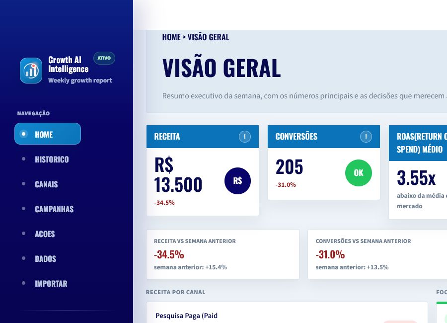
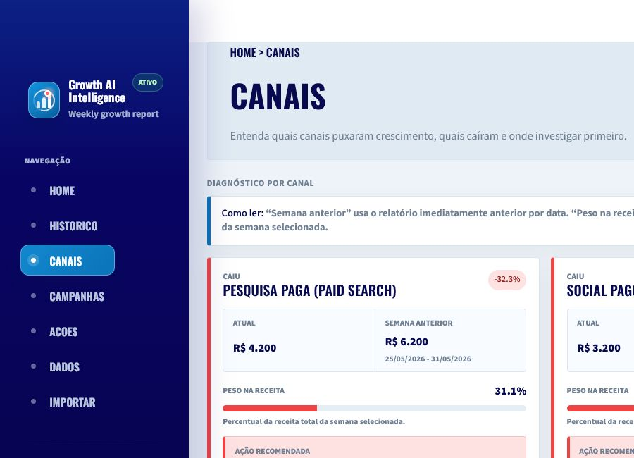
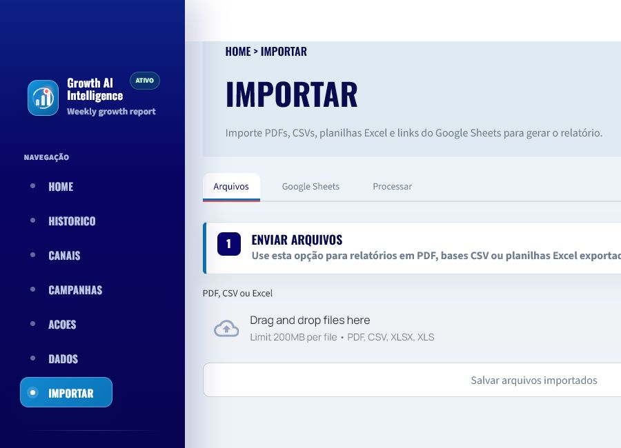

# 🚀 Growth AI Intelligence

**Agente de IA para relatórios semanais de Growth Marketing.**

Toda segunda-feira às 6h, o projeto coleta dados de growth, normaliza fontes diferentes,
envia os dados tratados para uma IA e gera um relatório executivo em JSON. Às 8h, o time
pode abrir o dashboard Streamlit e ver receita, conversões, ROAS, canais em queda,
campanhas para escalar, riscos e recomendações da semana.



## ✨ O que esse projeto resolve

Times de growth normalmente recebem dados em formatos diferentes:

- CSV exportado do Google Ads;
- planilha Excel do CRM;
- Google Sheets compartilhado pelo time;
- PDF com relatório manual;
- páginas HTML ou textos internos.

O problema é que cada fonte usa nomes de colunas diferentes. Este agente não depende de
uma tabela fixa. Antes da IA gerar o relatório, ele converte tudo para um **schema interno
comum**.

## 🧠 Como funciona a normalização

O pipeline agora tem uma camada de normalização em `src/growth_report/normalization.py`.

Ela identifica a fonte, mapeia colunas equivalentes e transforma cada linha em um registro
padronizado:

```json
{
  "source_name": "Google Ads Export",
  "source_kind": "google_ads",
  "channel": "Pesquisa Paga (Paid Search)",
  "campaign": "Brand Protection",
  "spend": 1200,
  "clicks": 540,
  "conversions": 88,
  "revenue": 6200,
  "currency": "BRL"
}
```

### Exemplos de mapeamento

| Origem | Colunas possíveis | Campo interno |
| --- | --- | --- |
| Google Ads | `Cost`, `Spend`, `Custo` | `spend` |
| CRM | `Leads`, `Vendas`, `Conversions` | `conversions` |
| Financeiro | `Revenue`, `Receita`, `Faturamento` | `revenue` |
| Campanhas | `Campaign`, `Nome da campanha`, `Campanha` | `campaign` |
| Canais | `Channel`, `Canal`, `Origem`, `Plataforma` | `channel` |

### Exemplo prático

CSV do Google Ads:

```csv
Campaign,Cost,Clicks,Conversions,Revenue
Brand Protection,"R$ 1.200,00",540,88,"R$ 6.200,00"
```

Excel do CRM:

```text
Nome da campanha | Investimento | Leads | Receita
Reativação CRM   | 250          | 39    | 2100
```

PDF de relatório:

```text
Campanha Proteção de Marca teve 120 leads e R$ 4.500 de receita.
```

Todos viram registros comparáveis antes da IA analisar.

## 📸 Telas do sistema

### Visão geral executiva

Mostra os principais indicadores da semana: receita, conversões, ROAS, riscos, variação
contra a semana anterior e próximos passos.


### Diagnóstico por canal

Mostra quais canais cresceram, quais caíram, peso na receita e ação recomendada.



### Central de importação

Permite importar PDF, CSV, Excel e links de Google Sheets para alimentar o próximo relatório.



## 🏗️ Arquitetura

```text
Fontes externas
  ├─ PDF
  ├─ CSV
  ├─ Excel
  ├─ Google Sheets
  └─ HTML/Textos
        ↓
Coletores
        ↓
Normalização de dados
        ↓
Schema interno comum
        ↓
Gemini/OpenAI
        ↓
JSON estruturado
        ↓
Storage local
        ↓
Dashboard Streamlit
```

## 📁 Estrutura do projeto

```text
src/growth_report/
  collectors/          # Coleta PDF, CSV, Excel, Sheets, HTML e texto
  normalization.py     # Mapeia colunas diferentes para um schema comum
  services/            # Geração com IA e persistência
  ui/                  # Componentes e páginas do dashboard
  pipeline.py          # Orquestra coleta → normalização → IA → storage
  cli.py               # Comandos growth-report run/schedule

data/
  raw/                 # Arquivos importados ou exemplos locais
  reports/             # Histórico weekly_reports.json

docs/images/           # Screenshots usados neste README
tests/                 # Testes automatizados
```

## 🔌 Fontes suportadas

| Tipo | Descrição |
| --- | --- |
| `csv_file` / `csv_url` | CSV local ou remoto |
| `excel_file` / `excel_url` | Planilhas `.xlsx` e `.xls` |
| `google_sheets_url` | Google Sheets público exportado como CSV |
| `pdf_file` / `pdf_url` | Relatórios em PDF |
| `html_url` | Página web |
| `text_file` | Texto local |

## ⚙️ Setup

```powershell
cd C:\Users\Pichau\Documents\Codex\2026-06-05\projeto-weekly-growth-intelligence-report-uma\outputs\weekly-growth-intelligence-report
python -m venv .venv
.\.venv\Scripts\Activate.ps1
pip install -e ".[dev]"
Copy-Item .env.example .env
```

Edite o `.env`:

```env
AI_PROVIDER=gemini
GEMINI_API_KEY=sua-chave-do-gemini
GEMINI_MODEL=gemini-2.5-flash-lite
```

Para usar OpenAI:

```env
AI_PROVIDER=openai
OPENAI_API_KEY=sua-chave-openai
OPENAI_MODEL=gpt-4.1-mini
```

## 🧪 Rodar sem gastar API

```powershell
growth-report run --config config.example.toml --dry-run
```

O modo `--dry-run` valida coleta, normalização, storage e dashboard sem enviar dados para
Gemini/OpenAI.

## 🤖 Rodar com IA

```powershell
growth-report run --config config.example.toml
```

O pipeline salva o relatório em:

```text
data/reports/weekly_reports.json
```

## 📊 Abrir o dashboard

```powershell
streamlit run src/growth_report/dashboard.py
```

Depois abra:

```text
http://localhost:8501
```

## ⏰ Agendamento semanal

```powershell
growth-report schedule --config config.example.toml
```

Configuração padrão:

```toml
[scheduler]
timezone = "America/Sao_Paulo"
day_of_week = "mon"
hour = 6
minute = 0
```

## 🧩 Exemplo de configuração de fontes

```toml
[[sources]]
name = "Google Ads Export"
type = "csv_file"
path = "data/raw/google_ads.csv"
enabled = true
tags = ["google-ads", "paid-search"]

[[sources]]
name = "CRM Leads"
type = "excel_file"
path = "data/raw/crm_leads.xlsx"
enabled = true
tags = ["crm", "leads"]

[[sources]]
name = "Growth Sheet"
type = "google_sheets_url"
url = "https://docs.google.com/spreadsheets/d/ID_DA_PLANILHA/edit#gid=0"
enabled = true
tags = ["google-sheets", "kpis"]

[[sources]]
name = "Relatório executivo PDF"
type = "pdf_file"
path = "data/raw/relatorio.pdf"
enabled = true
tags = ["pdf", "management"]
```

## ✅ Qualidade e testes

```powershell
.\.venv\Scripts\python.exe -m ruff check src tests
.\.venv\Scripts\python.exe -m pytest
```

Coberturas importantes:

- extração de CSV/Excel;
- URL de Google Sheets para export CSV;
- normalização de colunas em inglês e português;
- extração simples de métricas em texto/PDF;
- validação do provider Gemini/OpenAI;
- métricas e formatadores do dashboard.

## 🛠️ Boas práticas aplicadas

- Pydantic para schemas fortes e JSON confiável.
- Separação por camadas: coletores, normalização, IA, storage e UI.
- Configuração externa por TOML e `.env`.
- Modo `dry-run` para testar sem gastar API.
- Testes automatizados para normalização e fluxo principal.
- Dashboard dividido por páginas para facilitar manutenção.
